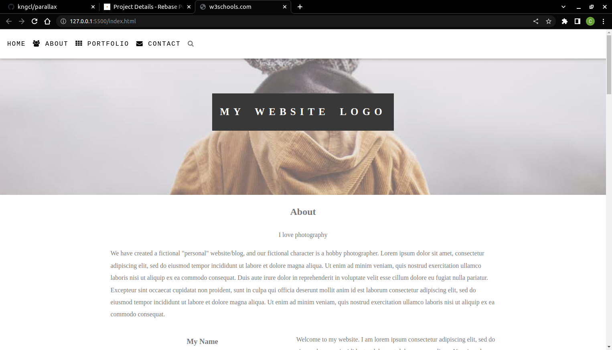

# parallax project

We have created a fictional "personal" website/blog, and our fictional character is a hobby photographer.

## App

### Built With

- HTML
- CSS

### Prerequisites

Knowledge about:

- HTML
- CSS
- Google chrome
  
## Clone project

- To get a local copy up and running follow these simple example steps.
- Clone this repository with `git@github.com:kngcl/parallax.git` using your terminal.
- Change to the project directory by entering: cd parallax in the terminal.

## steps

- $ git clone `git@github.com:kngcl/parallax.git`
- $ `cd parallax`
- $ `git checkout feature/footer`

## Start App

- run by opening the index.html in the browser

## Author

👤 **kngcl**

- GitHub: [@kngcl](https://github.com/kngcl/parallax)

## 🤝 Contributing

Contributions, issues, and feature requests are welcome!

Feel free to check the [issues page](https://github.com/kngcl/parallax/issues).

## 📝 License

This project is [w3school](./LICENSE) licensed.
